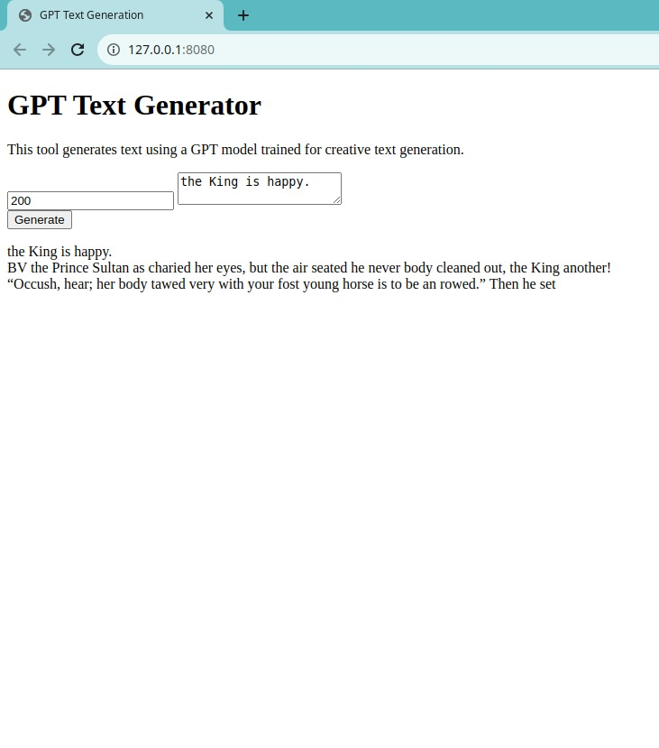

# Children Stories Text Generator

This Children Stories Text Generator is a web-based interface that uses a GPT model to create enchanting tales for children. Start with a phrase, and let the AI spin a yarn!

## Features:
- Creative text generation for children's stories
- Real-time generation display
- Customizable story length

## How to Use:
1. Enter a starting phrase.
2. Set the desired story length.
3. Press "Generate" and watch the story unfold.

## Technology:
Built with ONNX Runtime Web, JavaScript, HTML, and CSS for an interactive experience directly in your browser.

The generated content offers a glimpse into the imaginative possibilities of AI storytelling. It's designed to be a fun and creative tool for both education and entertainment.

Happy storytelling!
